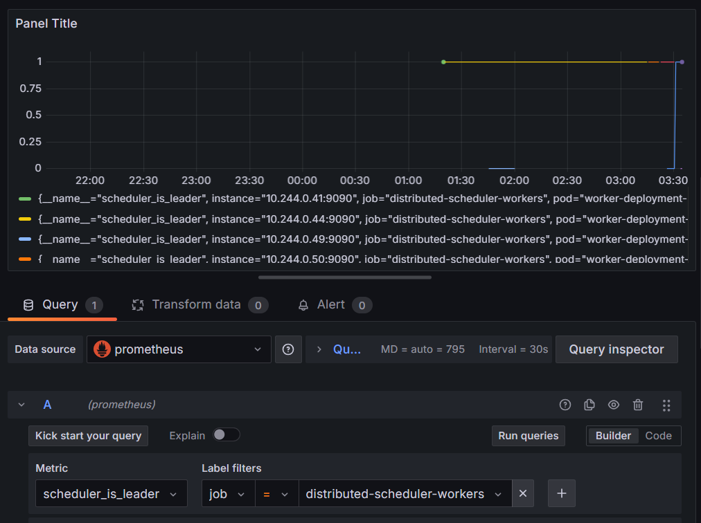

# Distributed Job Scheduler

A resilient, distributed task scheduler built in C#/.NET. It features lease-based leader election, Kafka-backed job dispatch, idempotent at-least-once execution guarantees, and event-driven autoscaling.

## Why This Exists

Most "job scheduler" side projects are simple, single-process cron wrappers. This system is designed to survive the actual failure modes encountered in production distributed systems:

* **Node Crashes Mid-Job:** If a worker dies, another node picks up the retry. The idempotency layer guarantees the job won't run twice, even if the crashed node partially completed the work.
* **Leader Failures:** If the leader dies, a new leader is elected within one lease TTL (default 10s). Scheduled dispatch never silently stalls.
* **Exactly-Once Execution:** Kafka provides at-least-once redelivery. The unique index on `IdempotencyKey` in MongoDB deduplicates these redeliveries, achieving "exactly-once" execution.
* **Poison Pill Handling:** Jobs that consistently fail use exponential backoff with jitter before being automatically routed to a Dead-Letter Queue (DLQ) after `MaxAttempts`.
* **Event-Driven Autoscaling:** On Kubernetes, worker replicas scale dynamically based on live Kafka consumer lag via KEDA, bursting to handle sudden spikes and settling back down once the backlog clears.
* **First-Class Observability:** Native Prometheus metrics and a Grafana dashboard for real-time monitoring of job throughput, failure rates, DLQ size, and leader elections.

## Architecture

```text
        +----------+   +----------+   +----------+
        | Worker 1 |   | Worker 2 |   | Worker 3 |   <- replica count is fixed
        | (leader) |   |          |   |          |      in Compose, dynamic
        +----+-----+   +----+-----+   +----+-----+      under Kubernetes+KEDA
             |              |              |
             |   heartbeat  |   heartbeat  |
             +------+-------+-------+------+
                     v               v
              +-------------------------+
              |   MongoDB: leader_lease |  <- lease-based election (CAS via
              |   MongoDB: job_executions|    findOneAndUpdate), no Raft needed
              +-------------------------+
                     ^               ^
             (leader dispatches)  (all workers consume + claim)
                     |               |
              +------+---------------+------+
              |   Kafka: jobs.pending        |  <- KEDA polls lag here
              |   Kafka: jobs.retry          |
              |   Kafka: jobs.dlq            |
              +-------------------------------+
                              ^
                       +------+------+
                       |  Api (REST) |  <- submit jobs, check status, replay DLQ
                       +-------------+
```

### Key Design Decisions & Trade-offs

| Decision | Why We Chose It | The Trade-off |
| :--- | :--- | :--- |
| **Lease-based election via MongoDB CAS** | Requires significantly less code than implementing Raft, while still handling real failure reasoning (split-brain, fencing tokens). | MongoDB becomes a coordination single point of failure (acceptable here, as Mongo typically runs as a replica set in production). |
| **Idempotency via unique index** | Simple, atomic database operation. No separate distributed lock service (like Redis) is required. | Requires API callers to supply a meaningful, stable `IdempotencyKey`. |
| **Kafka key = Idempotency key** | The same logical job always lands on the same partition, preserving execution order for that specific job. | Retries of the same job cannot be parallelized across multiple partitions. |
| **Manual offset commit post-execution** | No message is "acknowledged" until fully processed, enforcing at-least-once semantics. | A crash between execution and commit causes a harmless redelivery (caught by the idempotency layer). |

## Observability: Watching Leadership Failover Live

The `scheduler_is_leader` gauge (exposed per-worker via Prometheus, see `AppMetrics.IsLeader`) makes leader election directly observable, rather than something you have to infer from logs. Here's a real Grafana panel captured during a chaos test:



Each line is one worker pod. For most of the window, exactly one line sits at `1` (the current leader) while the others sit flat at `0` (followers, actively consuming jobs but not scheduling). At approximately **03:30**, the leader pod was killed mid-test: its line drops to `0` at the same instant a different worker's line jumps to `1` — a new leader was elected well within the 10-second lease TTL, with zero gap where no leader existed at all.
This is the same handoff described in "The Chaos Test" below, but observed directly through metrics instead of grepping logs.

## Two Ways to Run This

This project supports two deployment paths, deliberately, for different purposes:

| | Docker Compose | Kubernetes + KEDA |
| :--- | :--- | :--- |
| **Purpose** | Fast local development, quick to inspect | Demonstrates real autoscaling |
| **Worker replicas** | Fixed at 3 | Dynamic: 1-20, driven by Kafka lag |
| **Setup effort** | One command, no extra tooling | Requires a local cluster (Minikube/Kind) + Helm + KEDA |

## Getting Started (Docker Compose)

### Prerequisites
* Docker Desktop (with Docker Compose)

### Running Locally
Spin up the entire stack (MongoDB, Kafka, Zookeeper, 3 worker replicas, Prometheus, Grafana, and the Api) with one command:

```bash
docker compose up --build
```

* The Api is available at `http://localhost:5080`.
* Prometheus is available at `http://localhost:9090`.
* Grafana is available at `http://localhost:3000` (login: `admin` / `admin`).

---

## Api Usage

**1. Submit a new job**
```bash
curl -X POST http://localhost:5080/jobs \
  -H "Content-Type: application/json" \
  -d '{"idempotencyKey":"send-invoice-4821","jobType":"send-email","payloadJson":"{\"to\":\"a@b.com\"}"}'
```

**2. Check job status**
```bash
curl http://localhost:5080/jobs/send-invoice-4821
```

**3. View the Dead-Letter Queue (DLQ)**
*(Note: the sample job handler is hardcoded to fail ~30% of the time, specifically to exercise this path.)*
```bash
curl http://localhost:5080/dlq
```

**4. Replay a dead-lettered job**
```bash
curl -X POST http://localhost:5080/dlq/send-invoice-4821/replay
```

## Autoscaling with KEDA (Kubernetes)

The worker Deployment is fully decoupled from the Api and scales based on live Kafka consumer group lag, using KEDA rather than plain CPU/memory-based HPA — a job queue's real bottleneck is backlog size, not CPU usage, since a worker can be I/O-idle while still falling behind.

### Prerequisites
* A local Kubernetes cluster (Minikube recommended; Docker Desktop's built-in Kubernetes and Kind also work)
* Helm
* KEDA installed into the cluster:
```bash
  helm repo add kedacore https://kedacore.github.io/charts
  helm repo update
  helm install keda kedacore/keda --namespace keda --create-namespace
```

### Deploying

Build images so your cluster's local Docker daemon can see them (see `k8s/` manifests, all set to `imagePullPolicy: Never`), then:

```bash
kubectl apply -f k8s/mongo.yaml
kubectl apply -f k8s/kafka.yaml
kubectl apply -f k8s/prometheus-config.yaml
kubectl apply -f k8s/prometheus-deployment.yaml
kubectl apply -f k8s/prometheus-rbac.yaml
kubectl apply -f k8s/grafana-deployment.yaml
kubectl apply -f k8s/api-deployment.yaml
kubectl apply -f k8s/worker-deployment.yaml
kubectl apply -f k8s/worker-scaledobject.yaml
```

### How it works

The `ScaledObject` monitors consumer lag on both `jobs.pending` and `jobs.retry`. Once lag on either topic crosses the configured threshold, KEDA drives the underlying HPA to add worker replicas; once the backlog drains, it scales back down to the configured minimum after a cooldown period.

**Implementation (`worker-scaledobject.yaml`):**
```yaml
apiVersion: keda.sh/v1alpha1
kind: ScaledObject
metadata:
  name: worker-scaledobject
  namespace: default
spec:
  scaleTargetRef:
    name: worker-deployment
  minReplicaCount: 1
  maxReplicaCount: 20
  cooldownPeriod: 120
  pollingInterval: 15
  triggers:
    - type: kafka
      metadata:
        bootstrapServers: kafka.default.svc.cluster.local:9092
        consumerGroup: job-executors
        topic: jobs.pending
        lagThreshold: "50"
        offsetResetPolicy: earliest
    - type: kafka
      metadata:
        bootstrapServers: kafka.default.svc.cluster.local:9092
        consumerGroup: job-executors
        topic: jobs.retry
        lagThreshold: "50"
        offsetResetPolicy: earliest
```

**Note on `bootstrapServers`:** the fully-qualified `kafka.default.svc.cluster.local:9092` form is required here, not the short `kafka:9092` form — KEDA's operator runs in its own `keda` namespace, and Kubernetes' built-in DNS only resolves bare service names within the same namespace as the caller. The Kafka broker's own `KAFKA_ADVERTISED_LISTENERS` setting must use the same fully-qualified form for the same reason, since that's the address Kafka hands back to any client (including KEDA) after the initial connection.

### Watching it scale

```bash
kubectl get hpa -w
```

To reliably trigger a visible scale-up in a demo, it's more predictable to pause consumption first, then let a backlog build with zero contest, rather than racing a load-generation script against a live consumer:

```bash
kubectl scale deployment worker-deployment --replicas=0
# publish a burst of jobs via the Api here
kubectl get hpa -w   # minReplicaCount=1 kicks in, then klimbs as lag is read
```

## The "Chaos" Test: Proving Failover

This system is built for resilience. You can prove the failover mechanics work by intentionally breaking the cluster.

**Docker Compose:**
1. Watch the logs to see which worker currently holds leadership:
```bash
   docker compose logs -f worker-1 worker-2 worker-3 | grep -i leadership
```
2. Submit a batch of jobs via the Api, then kill the current leader mid-flight:
```bash
   docker compose kill worker-1
```

**Kubernetes:**
1. Find the current leader directly from the source of truth:
```bash
   kubectl exec -it <mongo-pod-name> -- mongosh
```
```javascript
   use scheduler
   db.leader_lease.findOne()
```
2. Tail logs across every worker so you don't miss the handoff:
```bash
   kubectl logs -f -l app=worker --prefix=true
```
3. Kill exactly that pod:
```bash
   kubectl delete pod <holderNodeId-from-step-1>
```

**Either way, verify:**
* A new leader is elected within ~10 seconds (the lease TTL).
* Scheduled dispatch resumes.
* `GET /jobs/{key}` for every submitted job shows `Status == Succeeded` exactly once — no jobs lost, none executed twice.

## Roadmap

* **Cron-based Scheduling:** Swap the demo 15s dispatch loop for true cron expressions (e.g. via the `Cronos` NuGet package), enabling syntax like `"0 */5 * * * *"`.
* **Proper Delay-Queue Polling:** Replace the busy-wait retry-delay check in the executor with a background poller reading a Mongo collection sorted by `NotBeforeUtc`.
* **Automated Integration Testing:** Testcontainers (Mongo + Kafka) to verify failover behavior automatically in CI, rather than only via the manual chaos test above.
* **Transactional Outbox:** Close the dual-write gap between MongoDB state changes and Kafka publishes in the retry/DLQ path, so a crash between the two can't leave them inconsistent.